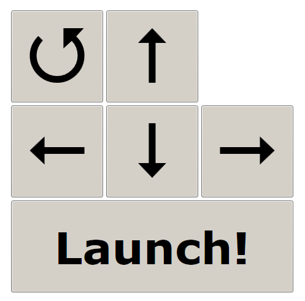

# KiepMissileLauncher
### A C# WPF shell for USB Missile Launcher, that can be controlled with 2 buttons

The original missile launcher is started in the background, and this shell application is put fullscreen on top of it. It forwards the mouse clicks and key presses to the original application.

 - Keyboard numpad `+` = Choose function
 - Keyboard numpad `/` = Execute function

This application uses a [low level keyboard hook](LowLevelKeyboardHook.cs), in order to catch the key presses even if another application (like [Tobii Dynavox Communicator](http://www.tobiidynavox.com/)) is preventing the keys to reach the application.

